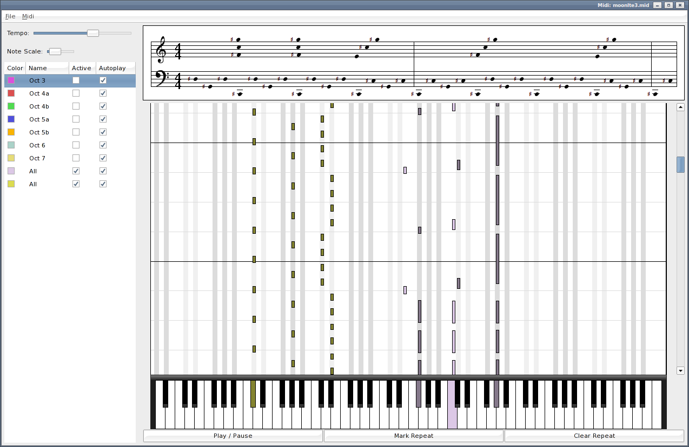

Midi
====

A piano tutor which can accompany or follow along with midi files.

Features
--------

* Load midi files.
* Play on external midi hardware.
* Pauses for user to play notes on external keyboard.
* Mark and repeat sections.
* Freely scroll back and forward through the file.
* Choose tracks to activate or autoplay.
* Transpose octave up/down.
* Plays waiting notes on channel 0 for keyboards with guide lamps.

Install
-------
* Replace lib/swt.jar with your platform specific library from: from http://www.eclipse.org/swt/.

* Build with ant:

		ant jar

Usage
-----

	java -jar midi.jar [file]
